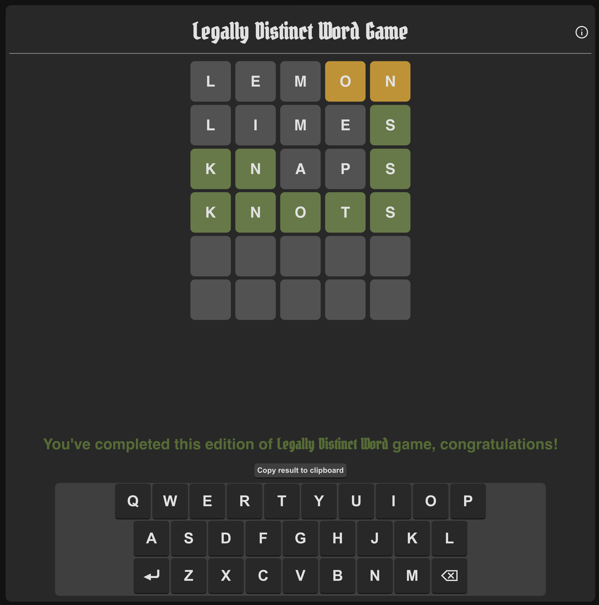

# joy-of-react-wordle

Implementation for the Wordle project within the [Joy of React](https://www.joyofreact.com/) course.

A live version of the project (deployed via GH Pages) should be available [here](https://mdhillman.github.io/joy-of-react-wordle/).

My take on this is a pretty simple React project, written using JS (rather than Typescript) without major use of any libraries. As a little extension task, I've also updated it to pick words from (roughly) the same list that the NY Times does, and added support for light & dark theme as well as _attempted_ to make the CSS usable on mobile platforms.

If want to explore the functionality and have trouble guessing the target work, check the console output.
